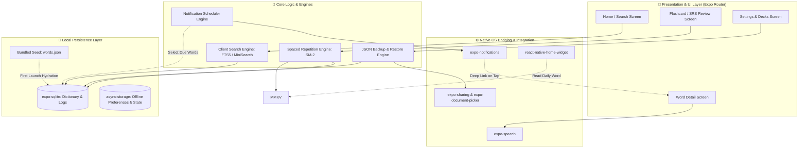
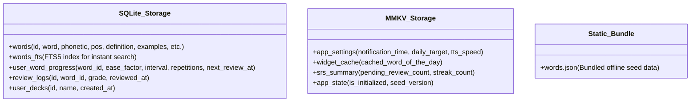
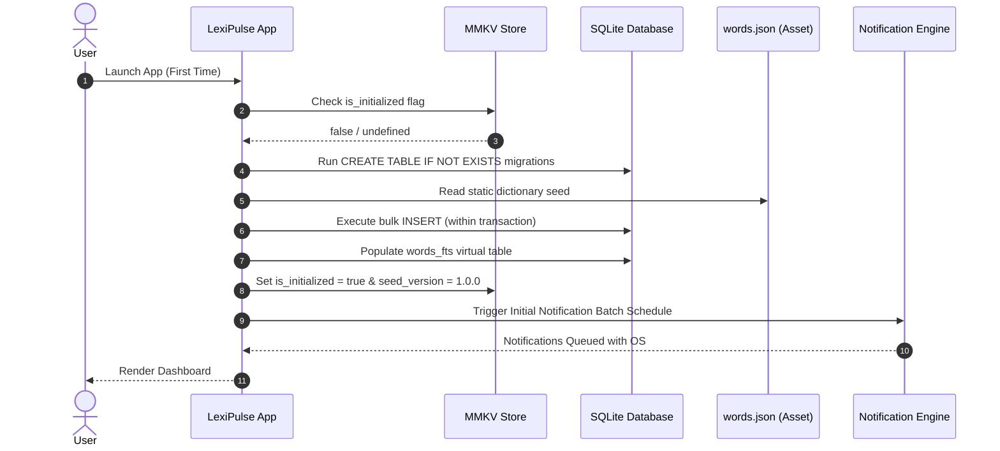
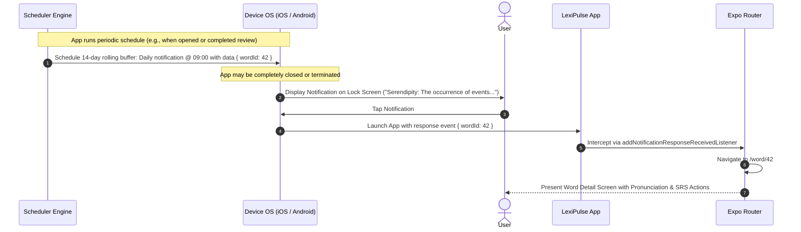
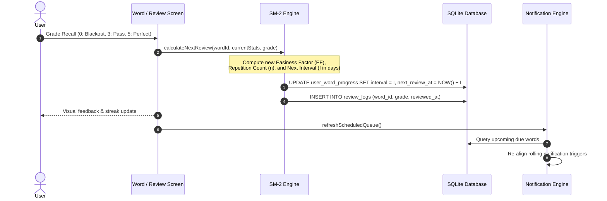

# LexiPulse Architecture Specification

> **Version:** 1.0.0  
> **Status:** Active / Blueprint  
> **Runtime Environment:** Expo Managed Workflow (React Native)  
> **Network Requirement:** 0% (Fully Offline & Autonomous)

---

## 1. Architectural Overview & Philosophy

**LexiPulse** is engineered as a **100% offline, zero-server vocabulary companion**. Unlike traditional language and flashcard applications that rely on remote REST/GraphQL APIs, web push gateways (APNs/FCM servers), or cloud-synced databases, LexiPulse executes **all operations strictly on the client device**.

### Core Tenets
1. **Zero External Dependencies at Runtime:** No backend servers, third-party user telemetry, authentication endpoints, or external dictionary APIs.
2. **Deterministic Local Scheduling:** Vocabulary delivery relies entirely on OS-native calendar/interval notification triggers managed via `expo-notifications`.
3. **Instant Latency (< 16ms):** All search lookups, spaced-repetition recalculations, and audio synthesis operate without network latency or round-trips.
4. **Data Sovereignty & Absolute Privacy:** The user's vocabulary progress, search history, custom notes, and deck bookmarks never leave the device. Backups are exported as user-controlled JSON files.

---

## 2. System Architecture Diagram

---

## 3. Structural Layer Breakdown

### 3.1 Presentation Layer (UI)
Built with **React Native** and structured via **Expo Router** (file-based navigation):
* `app/index.tsx`: Main dashboard featuring Word of the Day, search bar, retention statistics, and daily review quota.
* `app/word/[id].tsx`: Comprehensive view displaying phonetics, grammatical part of speech, contextual explanations, interactive audio button, and example sentences.
* `app/review/index.tsx`: Focused flashcard interface for active SuperMemo-2 spaced repetition reviews.
* `app/decks/index.tsx`: Custom user decks, starred words, and categorization.
* `app/settings/index.tsx`: Notification timing schedules, audio pitch/rate controls, and data backup/restore.

### 3.2 Core Logic Engines

| Engine | Responsibility | Primary Implementation |
| :--- | :--- | :--- |
| **Notification Scheduler** | Computes due/unread words and schedules a rolling buffer of local OS notifications. | Pre-computes 7–14 days of triggers via `expo-notifications`. |
| **Spaced Repetition (SRS)** | Implements SuperMemo-2 (SM-2) to dynamically adjust repetition interval ($I$) and easiness factor ($EF$). | Pure TypeScript mathematical module operating directly against local SQLite records. |
| **Full-Text Search Engine** | Delivers sub-millisecond prefix, phonetic, and definition search across 10,000+ words. | SQLite FTS5 virtual table or embedded in-memory index via `MiniSearch`. |
| **TTS Audio Engine** | Synthesizes pronunciation and sentence reading on-the-fly without audio asset downloads. | `expo-speech` tapping into iOS AVFoundation and Android TextToSpeech native engines. |
| **Backup & Migration Engine** | Serializes user progress, custom decks, and review logs into formatted JSON; handles file I/O and validation. | `expo-sharing` and `expo-document-picker`. |

### 3.3 Persistence Layer Partitioning

LexiPulse bifurcates persistence based on access characteristics and relational requirements:

* **Relational Storage (`expo-sqlite`):** Handles the dictionary, full-text search indexes, spaced repetition history, and relational data. SQLite supports ACID transactions and complex filtering (e.g., retrieving words due for review filtered by difficulty).
* **Key-Value Storage (`@react-native-async-storage/async-storage`):** Handles asynchronous reads and writes for application settings, notification schedules, and streak counters across both Expo Go and standalone native builds.
* **Static Asset (`words.json`):** Bundled into the app binary during compilation. Serves as the immutable seed source during initial cold boot hydration.

---

## 4. End-to-End Data Flows

### 4.1 Cold Boot & First Run Hydration

### 4.2 Local Notification & Deep Linking Lifecycle

### 4.3 Spaced Repetition (SM-2) Feedback Loop

---

## 5. Offline-First Architectural Guarantees

### 5.1 Zero Cloud Dependency
LexiPulse does not initiate any HTTP, WebSocket, or GraphQL network requests. This ensures:
* **Total Resiliency:** Works seamlessly in airplane mode, remote locations, subway systems, and low-connectivity environments.
* **No Server Costs:** Zero operational server costs, no database hosting bills, and no push notification relay fees.
* **No Authentication Friction:** No user registration, passwords, email confirmations, or OAuth popups.

### 5.2 Battery & Resource Conservation
* **No Persistent Background Daemons:** The application does not maintain long-running headless background tasks or sockets. 
* **Native Alarm Handlers:** Scheduling uses the mobile operating system's native timer mechanisms (iOS `UNCalendarNotificationTrigger` and Android `AlarmManager`/WorkManager via Expo), waking only the OS notification system when a trigger fires.

### 5.3 Deterministic Rolling Notification Window
Mobile operating systems enforce strict limits on scheduled local notifications (e.g., iOS limits an app to 64 active scheduled notifications). 
* LexiPulse maintains a **Rolling Window Strategy**: On every app launch or review interaction, the Scheduler queries the next 14 to 30 days of words, clears exhausted notifications, and repopulates the local OS queue.
* If the user does not open the app for a week, notifications continue to fire uninterrupted from the local OS queue.

---

## 6. Security and Data Integrity

* **Encrypted Backups:** Backup files export clear JSON schemas that can optionally be protected or stored securely via the OS Files app or iCloud Drive / Google Drive device backups.
* **SQL Injection Prevention:** All queries to `expo-sqlite` use parameterized statements (`?` binding) to guarantee data integrity and prevent syntax errors when handling complex strings or phonetic symbols.
* **Strict Schema Migrations:** SQLite table creation and schema alterations execute via a versioned migration runner tracked inside MMKV (`schema_version`).

---

## 7. Cross-Reference Documentation

For detailed specifications of individual subsystems, refer to the documentation modules in `/docs`:

* [How LexiPulse Works (`docs/README.md`)](file:///home/otavioemanoel/Documentos/Projetos/LexiPulse/docs/README.md)
* [Data Schema & Persistence (`docs/DATA_SCHEMA.md`)](file:///home/otavioemanoel/Documentos/Projetos/LexiPulse/docs/DATA_SCHEMA.md)
* [Notification Engine & Deep Linking (`docs/NOTIFICATION_ENGINE.md`)](file:///home/otavioemanoel/Documentos/Projetos/LexiPulse/docs/NOTIFICATION_ENGINE.md)
* [Spaced Repetition Mechanics (`docs/SPACED_REPETITION.md`)](file:///home/otavioemanoel/Documentos/Projetos/LexiPulse/docs/SPACED_REPETITION.md)
* [Feature Specifications & Roadmap (`docs/FEATURES_AND_ROADMAP.md`)](file:///home/otavioemanoel/Documentos/Projetos/LexiPulse/docs/FEATURES_AND_ROADMAP.md)
* [Development & Setup Guide (`docs/DEVELOPMENT_GUIDE.md`)](file:///home/otavioemanoel/Documentos/Projetos/LexiPulse/docs/DEVELOPMENT_GUIDE.md)
