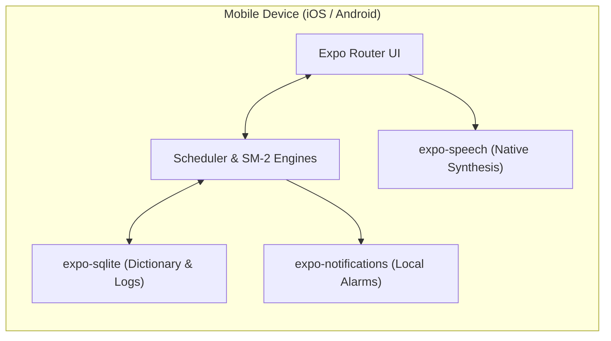

# Vocabula 📖⚡

> A completely offline, zero-server vocabulary companion that schedules curated words and deep explanations directly to your lock screen.

---

## 🌟 Overview

**Vocabula** is built for ambient, habitual vocabulary acquisition. Instead of demanding that you open an app every day to maintain a streak, Vocabula **delivers curated words, phonetics, and high-impact explanations directly to your mobile lock screen** at the times you choose.

Designed from the ground up as a **100% offline, zero-server mobile experience**, Vocabula requires **no accounts, no cloud sync, no tracking, and zero internet connectivity**. All data persistence, full-text searches, text-to-speech audio, and spaced repetition computations execute locally on your device.

```
       📱 Lock Screen Trigger (08:30 AM)
             │
             ├── "✨ Serendipity (noun)"
             │   "/ˌsɛr.ənˈdɪp.ə.ti/ • A fortunate accident."
             │
             ├── [ 🧠 I Know This ]  ──► Background SM-2 Quick-Grade
             └── [ 📖 Explore     ]  ──► Instant Deep Link to /word/serendipity
```

---

## ✨ Key Capabilities

* **📴 100% Offline & Private:** Zero network requests. No tracking telemetry, no backend servers, and zero cloud hosting costs.
* **⏰ Autonomous Local Scheduling:** Uses device-native calendar alarms via `expo-notifications` with a **14-day rolling buffer** that delivers words even if the app stays closed for weeks.
* **🔍 Instant Offline Search:** Sub-millisecond search across 10,000+ words using SQLite **FTS5 (Full-Text Search)**.
* **🧠 Adaptive Spaced Repetition:** Integrated **SuperMemo-2 (SM-2)** engine dynamically calculates review intervals ($I$) and easiness factors ($EF$).
* **🔊 Device-Native Audio (TTS):** Crystal-clear pronunciation powered by `expo-speech` with zero downloaded audio files.
* **📂 Custom Decks & Bookmarks:** Star favorite words, create thematic study decks, and write personal learning notes.
* **📲 Lock & Home Screen Widgets:** Ambient Word of the Day cards for your iOS and Android home screens via `react-native-home-widget`.
* **💾 Sovereign JSON Backup:** Full export and restore of vocabulary progress via standard `.json` files.

---

## 🏗️ Architecture at a Glance

Vocabula pairs local persistence with operating system-level native scheduling:



For the complete architectural blueprint, see **[ARCHITECTURE.md](file:///home/otavioemanoel/Documentos/Projetos/Vocabula/ARCHITECTURE.md)**.

---

## 📚 Documentation Suite

Comprehensive technical specifications and implementation guides are available in the [`/docs`](file:///home/otavioemanoel/Documentos/Projetos/Vocabula/docs) directory:

| Document | Focus Area | Description |
| :--- | :--- | :--- |
| **[ARCHITECTURE.md](file:///home/otavioemanoel/Documentos/Projetos/Vocabula/ARCHITECTURE.md)** | **System Architecture** | Structural layers, data flow sequence diagrams, and offline design decisions. |
| **[docs/README.md](file:///home/otavioemanoel/Documentos/Projetos/Vocabula/docs/README.md)** | **How It Works** | End-to-end user lifecycle, ambient lock screen delivery, and documentation hub. |
| **[docs/DATA_SCHEMA.md](file:///home/otavioemanoel/Documentos/Projetos/Vocabula/docs/DATA_SCHEMA.md)** | **Data & Storage** | Dictionary JSON seed, SQLite relational schema, FTS5 virtual tables, and TypeScript types. |
| **[docs/NOTIFICATION_ENGINE.md](file:///home/otavioemanoel/Documentos/Projetos/Vocabula/docs/NOTIFICATION_ENGINE.md)** | **Notification Engine** | Rolling window scheduling algorithm, OS limits (iOS 64 limit), lock-screen action buttons, and deep links. |
| **[docs/SPACED_REPETITION.md](file:///home/otavioemanoel/Documentos/Projetos/Vocabula/docs/SPACED_REPETITION.md)** | **Spaced Repetition** | SuperMemo-2 (SM-2) math formulas, Leitner 5-box model, and review state machine. |
| **[docs/FEATURES_AND_ROADMAP.md](file:///home/otavioemanoel/Documentos/Projetos/Vocabula/docs/FEATURES_AND_ROADMAP.md)** | **Features & Roadmap** | Specs for offline TTS, custom decks, widgets, JSON backup, and phased roadmap. |
| **[docs/DEVELOPMENT_GUIDE.md](file:///home/otavioemanoel/Documentos/Projetos/Vocabula/docs/DEVELOPMENT_GUIDE.md)** | **Developer Onboarding** | Folder structure, Expo setup, testing local notifications, and troubleshooting. |

---

## 🚀 Quick Start for Developers

### Prerequisites
* Node.js v18.18+
* Expo CLI (`npx expo`)
* iOS Simulator (macOS / Xcode) or Android Emulator (Android Studio)

### Installation
```bash
# Clone the repository
git clone https://github.com/Otavio-Emanoel/Vocabula.git
cd Vocabula

# Install dependencies
npm install

# Run on iOS
npx expo run:ios

# Run on Android
npx expo run:android
```

For detailed onboarding instructions, consult the **[Development Guide](file:///home/otavioemanoel/Documentos/Projetos/Vocabula/docs/DEVELOPMENT_GUIDE.md)**.

---

## 📄 License
This project is licensed under the MIT License.
