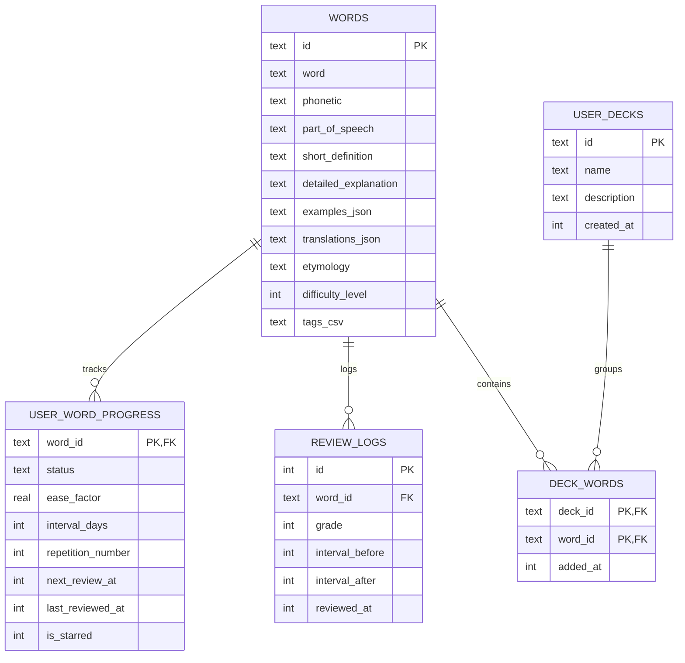

# LexiPulse Data Schema & Persistence Specification

This document details the data structures, database schema, search indexes, key-value registry, and TypeScript interfaces that power LexiPulse's 100% offline architecture.

---

## 1. Seed Dictionary Format (`words.json`)

The vocabulary database is initially packaged as a compressed, bundled JSON file (`assets/data/words.json`) within the application binary.

### Schema Fields
* `id` (string / number, required): Unique identifier for the word entry.
* `word` (string, required): The target headword.
* `phonetic` (string, required): International Phonetic Alphabet (IPA) representation (e.g., `/ˌsɛr.ənˈdɪp.ə.ti/`).
* `partOfSpeech` (string, required): Grammatical category (`noun`, `verb`, `adjective`, `adverb`, `idiom`, etc.).
* `shortDefinition` (string, required): Concise explanation optimized for lock-screen notification displays (< 120 characters).
* `detailedExplanation` (string, required): In-depth linguistic breakdown, usage notes, and contextual nuances.
* `examples` (array of objects, required): Practical contextual example sentences, optionally with translations or highlighted word markers.
* `translations` (object, optional): Key-value dictionary mapping ISO language codes (e.g., `pt`, `es`, `fr`) to local definitions.
* `etymology` (string, optional): Historical root and language origin.
* `difficultyLevel` (integer, required): Difficulty tier (1 = Beginner, 2 = Intermediate, 3 = Advanced, 4 = Literary/GRE).
* `tags` (array of strings, optional): Thematic tags (e.g., `["academic", "psychology", "gre"]`).

### Example Entry
```json
[
  {
    "id": "serendipity",
    "word": "Serendipity",
    "phonetic": "/ˌsɛr.ənˈdɪp.ə.ti/",
    "partOfSpeech": "noun",
    "shortDefinition": "The occurrence of events by chance in a happy or beneficial way.",
    "detailedExplanation": "First coined by Horace Walpole in 1754, serendipity refers to unexpected, fortunate discoveries made while looking for something entirely unrelated.",
    "examples": [
      {
        "sentence": "Finding my dream job while attending a casual coffee meetup was pure serendipity.",
        "context": "Professional career"
      },
      {
        "sentence": "Penicillin's discovery by Alexander Fleming remains history's most famous example of scientific serendipity.",
        "context": "Science history"
      }
    ],
    "translations": {
      "pt": "Serendipidade; dom de encontrar coisas boas por mero acaso.",
      "es": "Serendipia; hallazgo afortunado e inesperado que se produce cuando se busca otra cosa."
    },
    "etymology": "From the Persian fairy tale 'The Three Princes of Serendip' (old name for Sri Lanka).",
    "difficultyLevel": 3,
    "tags": ["literary", "positive", "creativity"]
  }
]
```

---

## 2. Relational Database Schema (`expo-sqlite`)

LexiPulse uses **SQLite** via `expo-sqlite` as its primary operational store. Relational tables store the immutable dictionary along with mutable user progress, bookmarks, and review history.



### 2.1 Table Definitions (DDL)

```sql
-- 1. Master Words Table
CREATE TABLE IF NOT EXISTS words (
    id TEXT PRIMARY KEY NOT NULL,
    word TEXT NOT NULL,
    phonetic TEXT NOT NULL,
    part_of_speech TEXT NOT NULL,
    short_definition TEXT NOT NULL,
    detailed_explanation TEXT NOT NULL,
    examples_json TEXT NOT NULL,       -- JSON-stringified array of Example objects
    translations_json TEXT,           -- JSON-stringified dictionary of translations
    etymology TEXT,
    difficulty_level INTEGER NOT NULL DEFAULT 1,
    tags_csv TEXT                     -- Comma-separated tags for simple filtering
);

-- Index for alphabetical ordering & headword lookups
CREATE INDEX IF NOT EXISTS idx_words_word ON words(word);
CREATE INDEX IF NOT EXISTS idx_words_difficulty ON words(difficulty_level);

-- 2. Full-Text Search (FTS5) Virtual Table
CREATE VIRTUAL TABLE IF NOT EXISTS words_fts USING fts5(
    id UNINDEXED,
    word,
    short_definition,
    detailed_explanation,
    tags_csv,
    tokenize = 'unicode61 remove_diacritics 1'
);

-- 3. User Word Progress & Spaced Repetition (SM-2) State
CREATE TABLE IF NOT EXISTS user_word_progress (
    word_id TEXT PRIMARY KEY NOT NULL,
    status TEXT NOT NULL DEFAULT 'new', -- 'new', 'learning', 'reviewing', 'mastered'
    ease_factor REAL NOT NULL DEFAULT 2.5,
    interval_days INTEGER NOT NULL DEFAULT 0,
    repetition_number INTEGER NOT NULL DEFAULT 0,
    next_review_at INTEGER NOT NULL,    -- Unix epoch timestamp (milliseconds)
    last_reviewed_at INTEGER,           -- Unix epoch timestamp (milliseconds)
    is_starred INTEGER NOT NULL DEFAULT 0, -- 0 = false, 1 = true
    FOREIGN KEY(word_id) REFERENCES words(id) ON DELETE CASCADE
);

CREATE INDEX IF NOT EXISTS idx_progress_next_review ON user_word_progress(next_review_at);
CREATE INDEX IF NOT EXISTS idx_progress_status ON user_word_progress(status);
CREATE INDEX IF NOT EXISTS idx_progress_starred ON user_word_progress(is_starred);

-- 4. Review Audit Logs
CREATE TABLE IF NOT EXISTS review_logs (
    id INTEGER PRIMARY KEY AUTOINCREMENT,
    word_id TEXT NOT NULL,
    grade INTEGER NOT NULL,             -- 0 (Blackout) to 5 (Perfect)
    interval_before INTEGER NOT NULL,
    interval_after INTEGER NOT NULL,
    reviewed_at INTEGER NOT NULL,       -- Unix timestamp
    FOREIGN KEY(word_id) REFERENCES words(id) ON DELETE CASCADE
);

CREATE INDEX IF NOT EXISTS idx_logs_reviewed_at ON review_logs(reviewed_at);

-- 5. User Custom Decks
CREATE TABLE IF NOT EXISTS user_decks (
    id TEXT PRIMARY KEY NOT NULL,
    name TEXT NOT NULL,
    description TEXT,
    created_at INTEGER NOT NULL
);

-- 6. Deck to Word Many-to-Many Join
CREATE TABLE IF NOT EXISTS deck_words (
    deck_id TEXT NOT NULL,
    word_id TEXT NOT NULL,
    added_at INTEGER NOT NULL,
    PRIMARY KEY (deck_id, word_id),
    FOREIGN KEY(deck_id) REFERENCES user_decks(id) ON DELETE CASCADE,
    FOREIGN KEY(word_id) REFERENCES words(id) ON DELETE CASCADE
);
```

---

## 3. High-Performance Full-Text Search Queries

With the `words_fts` virtual table populated, LexiPulse performs instant offline searches without scanning or lagging:

```sql
-- Prefix matching for instant search-as-you-type:
SELECT w.* 
FROM words w
JOIN words_fts fts ON w.id = fts.id
WHERE words_fts MATCH :query || '*'
ORDER BY rank
LIMIT 25;
```

---

## 4. Key-Value Storage Registry (`@react-native-async-storage/async-storage`)

For lightweight preferences and offline flags across both Expo Go and standalone builds, LexiPulse uses `@react-native-async-storage/async-storage`.

| Key | Type | Default Value | Purpose |
| :--- | :--- | :--- | :--- |
| `app.is_initialized` | `boolean` | `false` | Tracks whether initial JSON seed hydration has executed. |
| `app.seed_version` | `string` | `"1.0.0"` | Used for automatic dictionary migrations when app updates. |
| `settings.notification_time` | `string` | `"08:30"` | Daily notification trigger time in 24-hour format (`HH:mm`). |
| `settings.notifications_enabled` | `boolean` | `true` | Master toggle for local scheduling triggers. |
| `settings.daily_target` | `number` | `3` | Target count of words introduced per day (1 to 10). |
| `settings.tts_rate` | `number` | `1.0` | Pronunciation speed multiplier (0.5 to 1.5). |
| `settings.tts_pitch` | `number` | `1.0` | Pronunciation audio pitch multiplier. |
| `widget.word_cache` | `string` | `"{...}"` | JSON string of current Word of the Day for lock/home screen widgets. |
| `stats.current_streak` | `number` | `0` | Consecutive days the user completed their daily review. |
| `stats.last_active_date` | `string` | `""` | ISO Date (`YYYY-MM-DD`) of the last completed session. |

---

## 5. TypeScript Data Definitions

The following TypeScript contracts are used throughout the codebase:

```typescript
// types/dictionary.ts

export type PartOfSpeech =
  | 'noun'
  | 'verb'
  | 'adjective'
  | 'adverb'
  | 'pronoun'
  | 'preposition'
  | 'conjunction'
  | 'interjection'
  | 'idiom'
  | 'phrase';

export interface WordExample {
  sentence: string;
  context?: string;
  translation?: string;
}

export interface WordDefinition {
  id: string;
  word: string;
  phonetic: string;
  partOfSpeech: PartOfSpeech;
  shortDefinition: string;
  detailedExplanation: string;
  examples: WordExample[];
  translations?: Record<string, string>;
  etymology?: string;
  difficultyLevel: 1 | 2 | 3 | 4;
  tags?: string[];
}

// types/srs.ts

export type WordStatus = 'new' | 'learning' | 'reviewing' | 'mastered';

export interface UserWordProgress {
  wordId: string;
  status: WordStatus;
  easeFactor: number;       // Default: 2.5, Min: 1.3
  intervalDays: number;     // Days until next review
  repetitionNumber: number; // Consecutive successful repetitions
  nextReviewAt: number;     // Milliseconds Unix epoch
  lastReviewedAt?: number;  // Milliseconds Unix epoch
  isStarred: boolean;
}

export type ReviewGrade = 0 | 1 | 2 | 3 | 4 | 5;

export interface ReviewLog {
  id?: number;
  wordId: string;
  grade: ReviewGrade;
  intervalBefore: number;
  intervalAfter: number;
  reviewedAt: number;
}
```

---

## 6. Seed Ingestion & Database Migration Strategy

To guarantee rapid cold boot on the user's first launch:
1. **Batching with Transactions:** Word seeding must never execute via individual `INSERT` statements. `db.withTransactionAsync` wraps bulk inserts, inserting 10,000 words in under **250ms** on modern mobile hardware.
2. **Synchronous Virtual Table Sync:** The FTS5 table is populated inside the same transaction to maintain parity.
3. **Idempotency:** All DDL scripts use `IF NOT EXISTS` guards.
