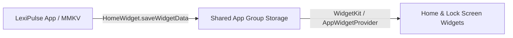
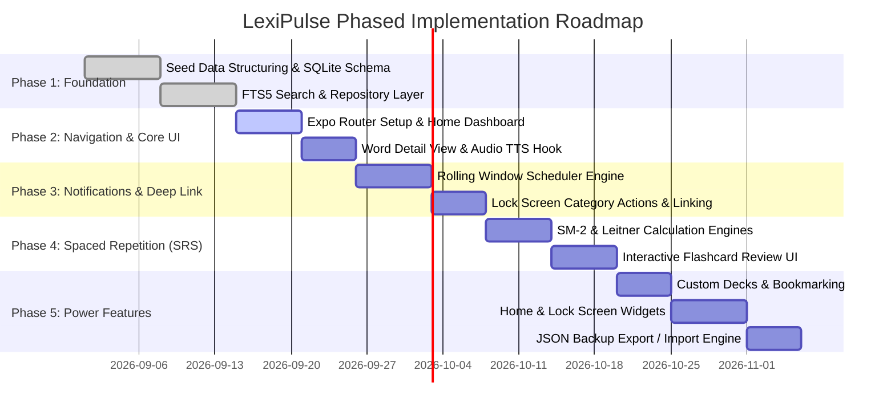

# LexiPulse Features Specification & Implementation Roadmap

This document outlines the functional specifications for LexiPulse's core and high-value offline features, followed by a phased engineering roadmap.

---

## 1. High-Value Offline Features

### 1.1 Device-Native Audio Pronunciation (TTS)
Instead of downloading and bundling hundreds of megabytes of MP3 audio files, LexiPulse interfaces directly with native operating system speech synthesis engines via `expo-speech`.

* **Subsystems Utilized:** iOS `AVSpeechSynthesizer` and Android `android.speech.tts.TextToSpeech`.
* **Zero Network & Storage Overhead:** Words and contextual sentences are vocalized synthetically at runtime without consuming network bandwidth or device disk space.
* **Capabilities:**
  * Configurable speech rate ($0.5\times$ to $1.5\times$) for ESL learners needing slower articulation.
  * Configurable pitch and regional accent selection (`en-US`, `en-GB`, `en-AU`).
  * Tap-to-pronounce on headword and individual example sentences.

```typescript
import * as Speech from 'expo-speech';

export function speakWord(word: string, language: string = 'en-US', rate: number = 0.9) {
  Speech.stop(); // Stop any currently playing utterance
  Speech.speak(word, {
    language,
    rate,
    pitch: 1.0,
  });
}
```

---

### 1.2 Custom User Decks, Bookmarks & Notes
LexiPulse allows users to curate their own learning experience while preserving 100% offline isolation:

* **Starred Words / Favorites:** Single-tap bookmarking to quickly flag words for immediate focus.
* **Custom Thematic Decks:** Users can create decks such as *"GRE High Frequency"*, *"Legal Terminology"*, or *"Creative Writing"*.
* **Custom Word Creation:** Users can add personal words not present in the seed dictionary with full phonetic, definition, and example fields.
* **Personal Context Notes:** Users can attach private memory anchors (mnemonics, personal anecdotes) to any word card.

---

### 1.3 Lock Screen & Home Screen Widgets
Through `react-native-home-widget`, LexiPulse pushes ambient vocabulary directly to the user's primary interface:

* **Supported Widget Formats:**
  * **iOS Lock Screen (Rectangular):** Headword + one-line definition.
  * **iOS/Android Home Screen (Small 2x2):** Headword, phonetic, and part of speech.
  * **iOS/Android Home Screen (Medium 4x2):** Full Word of the Day card with example sentence.
* **Architecture:** When a new day arrives or a notification fires, the app updates the shared App Group (iOS `UserDefaults` / Android `SharedPreferences`) via `HomeWidget.saveWidgetData()`, signaling native widgets to re-render without launching the full JS engine.



---

### 1.4 Zero-Cloud JSON Backup & Restore
To guarantee user data sovereignty, LexiPulse supports full backup and migration without requiring cloud databases or user accounts:

* **Export:** Serializes user progress, custom decks, review logs, and starred words into a structured, validated `.json` file. LexiPulse invokes `expo-sharing` to offer the standard OS share sheet (AirDrop, save to Files, send via email).
* **Import:** Reads user-selected files via `expo-document-picker`, validates the JSON schema against a version validator, and provides a choice between:
  * **Merge:** Retains existing progress and integrates imported decks.
  * **Clean Restore:** Overwrites local state with the backup.

#### Backup JSON Schema
```json
{
  "lexipulseVersion": "1.0.0",
  "exportedAt": 1726598400000,
  "stats": {
    "currentStreak": 14,
    "lastActiveDate": "2026-09-17"
  },
  "progress": [
    {
      "wordId": "serendipity",
      "status": "reviewing",
      "easeFactor": 2.6,
      "intervalDays": 6,
      "repetitionNumber": 2,
      "nextReviewAt": 1727116800000,
      "isStarred": true
    }
  ],
  "customDecks": [
    {
      "id": "deck_gre_01",
      "name": "GRE Vocabulary",
      "description": "High yield GRE words",
      "wordIds": ["serendipity"]
    }
  ]
}
```

---

## 2. Engineering Roadmap



### Phase Breakdown & Deliverables

| Phase | Milestone | Core Deliverables | Verification Criteria |
| :--- | :--- | :--- | :--- |
| **Phase 1** | **Data & Storage Foundation** | • Finalize `assets/data/words.json` dictionary.<br>• Implement `expo-sqlite` migration runner.<br>• Configure FTS5 search virtual tables.<br>• Benchmark transaction ingestion (< 300ms). | Unit tests verify fast search query execution (< 15ms) across 10,000 seeded words. |
| **Phase 2** | **Navigation & Core UI** | • Setup Expo Router (`/`, `/word/[id]`, `/settings`).<br>• Develop fluid dark-mode theme & typography.<br>• Integrate `expo-speech` pronunciation hook.<br>• Build search-as-you-type list with debounce. | Search UI responds instantly; audio pronunciation plays offline. |
| **Phase 3** | **Notification & Deep Linking** | • Build 14-day rolling buffer scheduler.<br>• Register interactive notification categories.<br>• Implement cold-start and warm deep linking.<br>• Add Android high-priority notification channels. | Tapping notification opens `/word/[id]` directly; "I Know This" executes silent review. |
| **Phase 4** | **Spaced Repetition (SRS)** | • Implement mathematical SM-2 and Leitner logic.<br>• Develop swipeable flashcard review screen.<br>• Track review logs and mastery states in SQLite.<br>• Create streak calculator and retention dashboard. | Reviewing cards accurately updates next interval and refreshes notification queue. |
| **Phase 5** | **Offline Ecosystem & Widgets** | • Custom decks and personal bookmarks.<br>• Native iOS/Android widgets via `react-native-home-widget`.<br>• JSON export & import with schema validation.<br>• Final end-to-end regression testing. | Users can restore data across devices and view daily words on home/lock screen widgets. |
