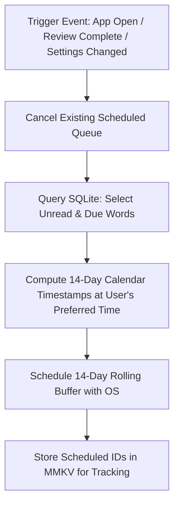
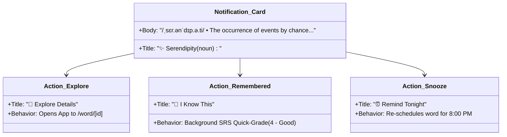

# Vocabula Notification Engine & Deep Linking

This document details the design and implementation of Vocabula's **100% offline, zero-server notification engine**, including local OS scheduling, the rolling-window buffer algorithm, interactive lock-screen buttons, and cold-start deep linking.

---

## 1. Zero-Server Philosophy

In conventional mobile architectures, notification systems require:
1. Device tokens registered with Apple Push Notification Service (APNs) and Firebase Cloud Messaging (FCM).
2. Remote application servers running Redis queues, cron workers, or cloud lambdas.
3. Network calls transmitting user IDs, device identifiers, and telemetry.

Vocabula **eliminates all server infrastructure**. It schedules notifications directly within the native operating system's calendar and interval alarm queues via `expo-notifications`.

| Attribute | Cloud Push (APNs / FCM) | Vocabula (Local Scheduling) |
| :--- | :--- | :--- |
| **Server Cost** | Recurring cloud bills & infrastructure | **$0.00 (Zero hosting or relay costs)** |
| **Network Reliance** | Fails in airplane mode / offline | **100% functional without internet** |
| **Privacy** | Tokens & habits sent to servers | **100% private (Device-only storage)** |
| **Delivery Reliability** | Subject to cloud outages & token drift | **Directly executed by OS Kernel/Alarms** |

---

## 2. Operating System Constraints & Challenges

Mobile operating systems enforce strict safety guards around local notifications to prevent spam and battery drain:

1. **iOS 64-Notification Limit:** iOS strictly limits each application to a maximum of **64 active scheduled local notifications**. If an app attempts to schedule 65 notifications, iOS discards or silences the excess.
2. **Android Exact Alarms & Doze Mode:** Android requires high-priority notification channels and appropriate exact alarm handling (`SCHEDULE_EXACT_ALARM` or `USE_EXACT_ALARM`) to ensure notifications trigger precisely at the configured minute, even when the device is idle in Doze mode.

---

## 3. The Rolling Pre-Scheduling Window Algorithm

To overcome operating system limits while ensuring continuous daily delivery even if the user does not open the app for days or weeks, Vocabula implements a **Rolling Window Pre-Scheduler**.



### 3.1 Algorithm Specification
* **Buffer Size ($N$):** 14 days.
* **Daily Frequency ($K$):** 1 to 3 words per day (configured in settings).
* Total queued notifications: $14 \times K \le 42$, well within the iOS 64-notification boundary.
* **Refresh Triggers:**
  1. **App Foregrounding (`AppState === 'active'`):** The app evaluates how many days have elapsed since the last re-schedule, cleans expired notifications, and appends fresh days to maintain a full 14-day horizon.
  2. **SRS Review Session Completion:** Recalculates due intervals and dynamically injects review items into the rolling schedule.
  3. **Time/Frequency Setting Changes:** Immediately clears and recalculates the queue.

### 3.2 Scheduling Logic Example (TypeScript)

```typescript
import * as Notifications from 'expo-notifications';
import { getNextUpcomingWords } from '@/db/queries';

export async function rescheduleRollingBuffer(dailyTarget: number = 1, triggerTime: string = "08:30") {
  // 1. Clear existing local scheduled notifications
  await Notifications.cancelAllScheduledNotificationsAsync();

  // 2. Parse target hour and minute
  const [targetHour, targetMinute] = triggerTime.split(':').map(Number);

  // 3. Query next batch of words (SRS due + unread words)
  const totalNeeded = 14 * dailyTarget;
  const wordsToSchedule = await getNextUpcomingWords(totalNeeded);

  let wordIndex = 0;
  const now = new Date();

  // 4. Register rolling calendar triggers
  for (let dayOffset = 0; dayOffset < 14; dayOffset++) {
    for (let slot = 0; slot < dailyTarget; slot++) {
      if (wordIndex >= wordsToSchedule.length) break;

      const word = wordsToSchedule[wordIndex++];
      const scheduledDate = new Date();
      scheduledDate.setDate(now.getDate() + dayOffset);
      scheduledDate.setHours(targetHour, targetMinute + (slot * 240), 0, 0); // Spaced by 4 hours if multiple

      // Skip past times for today
      if (scheduledDate.getTime() <= now.getTime()) continue;

      await Notifications.scheduleNotificationAsync({
        content: {
          title: `✨ ${word.word} (${word.partOfSpeech})`,
          body: `${word.phonetic} • ${word.shortDefinition}`,
          data: {
            wordId: word.id,
            scheduledTimestamp: scheduledDate.getTime(),
            action: 'word_detail',
          },
          categoryIdentifier: 'LEXIPULSE_WORD_CARD',
          sound: 'default',
        },
        trigger: {
          type: Notifications.SchedulableTriggerInputTypes.CALENDAR,
          hour: scheduledDate.getHours(),
          minute: scheduledDate.getMinutes(),
          day: scheduledDate.getDate(),
          month: scheduledDate.getMonth() + 1,
          year: scheduledDate.getFullYear(),
        },
      });
    }
  }
}
```

---

## 4. Interactive Lock-Screen Notification Categories

Vocabula defines native notification categories that give users quick actions directly from their lock screen without needing to launch the app:



### Category Registration Setup
```typescript
import * as Notifications from 'expo-notifications';

export async function registerNotificationCategories() {
  await Notifications.setNotificationCategoryAsync('LEXIPULSE_WORD_CARD', [
    {
      identifier: 'ACTION_EXPLORE',
      buttonTitle: '📖 Explore Details',
      options: {
        opensAppToForeground: true,
      },
    },
    {
      identifier: 'ACTION_REMEMBERED',
      buttonTitle: '🧠 I Know This',
      options: {
        opensAppToForeground: false, // Handled silently in background
      },
    },
    {
      identifier: 'ACTION_SNOOZE',
      buttonTitle: '⏰ Remind Tonight',
      options: {
        opensAppToForeground: false,
      },
    },
  ]);
}
```

---

## 5. Deep Linking & Cold-Start Navigation

When a user taps the notification or an action button, Vocabula ensures deterministic routing via **Expo Router**.

### 5.1 Handling the Two App Lifecycle States
1. **Cold Start (App was completely killed):** The system launches the app into memory. Vocabula calls `Notifications.getLastNotificationResponseAsync()` on startup to detect if a notification tap initiated the boot.
2. **Warm / Foreground (App was backgrounded or active):** The event is caught live by `Notifications.addNotificationResponseReceivedListener`.

### 5.2 Routing Implementation Pattern

```typescript
// app/_layout.tsx
import { useEffect } from 'react';
import { router } from 'expo-router';
import * as Notifications from 'expo-notifications';
import { handleQuickGrade, snoozeWordNotification } from '@/services/srs';

export default function RootLayout() {
  useEffect(() => {
    // 1. Check for Cold Boot notification tap
    Notifications.getLastNotificationResponseAsync().then((response) => {
      if (response) {
        handleNotificationResponse(response);
      }
    });

    // 2. Listen for Warm / Active notification responses
    const subscription = Notifications.addNotificationResponseReceivedListener(
      (response) => {
        handleNotificationResponse(response);
      }
    );

    return () => subscription.remove();
  }, []);

  const handleNotificationResponse = (response: Notifications.NotificationResponse) => {
    const { actionIdentifier } = response;
    const wordId = response.notification.request.content.data?.wordId;

    if (!wordId) return;

    if (actionIdentifier === 'ACTION_REMEMBERED') {
      // Background quick-grade without screen transition
      handleQuickGrade(wordId, 4);
    } else if (actionIdentifier === 'ACTION_SNOOZE') {
      // Re-schedule for later today
      snoozeWordNotification(wordId);
    } else {
      // Default tap or ACTION_EXPLORE: Navigate directly to word detail
      router.push(`/word/${wordId}`);
    }
  };

  return <Slot />;
}
```

---

## 6. Android Notification Channel Configuration

Android 8.0 (API level 26) and above requires notifications to be targeted to explicit Notification Channels:

```typescript
import * as Notifications from 'expo-notifications';
import { Platform } from 'react-native';

export async function setupAndroidChannels() {
  if (Platform.OS === 'android') {
    await Notifications.setNotificationChannelAsync('daily_vocabulary', {
      name: 'Daily Vocabulary',
      description: 'Scheduled ambient word of the day notifications',
      importance: Notifications.AndroidImportance.HIGH,
      vibrationPattern: [0, 250, 250, 250],
      lightColor: '#6366F1',
      enableVibrate: true,
      showBadge: true,
    });
  }
}
```
