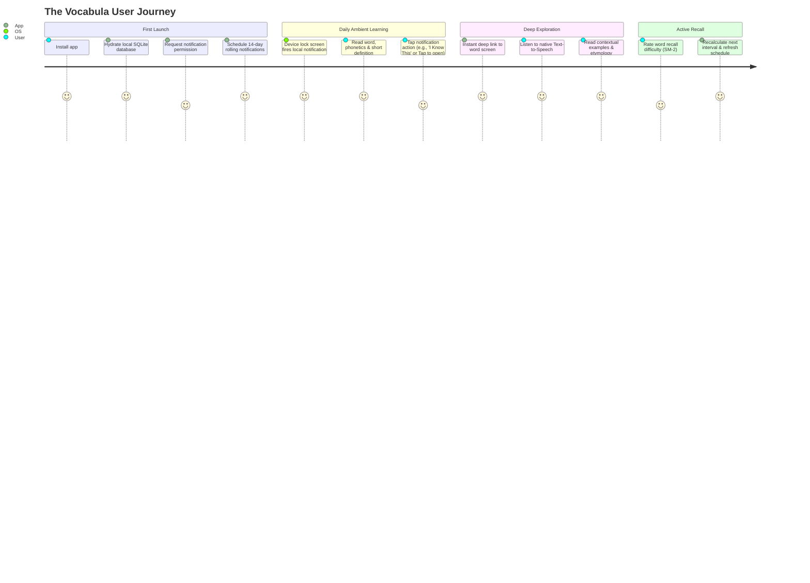

# Vocabula Documentation Hub

Welcome to the internal engineering and product documentation for **Vocabula** — a 100% offline, zero-server vocabulary companion for iOS and Android built on Expo and React Native.

---

## 📖 How Vocabula Works

Traditional language apps demand persistent internet connectivity, cloud accounts, and invasive notifications orchestrated by remote marketing servers. Vocabula inverts this model: **it treats your mobile device as an autonomous, self-contained learning sanctuary**.

Here is the lifecycle of how the app functions from end to end:

### 1. Zero-Friction Cold Start
* When the user installs and opens Vocabula for the first time, there is **no sign-in or account creation wall**.
* The app checks an MMKV flag (`is_initialized`). If absent, it unpacks a curated `words.json` seed asset directly into a high-performance local SQLite database (`expo-sqlite`), establishing full-text search indexes (FTS5) in milliseconds.

### 2. Autonomous Local Scheduling
* Vocabula requests notification permissions using `expo-notifications`.
* Instead of pinging a remote server to send push alerts, the **Notification Scheduler Engine** selects an unread or review-due word from the local database and registers a **local scheduled notification** with iOS `UNUserNotificationCenter` or Android `AlarmManager`.
* It populates a **rolling 14-day queue** so notifications continue to arrive predictably at the user's preferred time (e.g., 8:30 AM), even when the app remains closed for days.

### 3. Ambient Lock-Screen Delivery
* At the scheduled time, the device wakes its local notification display.
* The lock-screen card displays the Word of the Day, phonetic guide, and a high-impact concise definition.
* Users can grasp the meaning in 3 seconds directly on their lock screen without needing to open the app or break their concentration.

### 4. Zero-Latency Deep Linking & Exploration
* When the user taps the notification, the native notification response listener (`addNotificationResponseReceivedListener`) intercepts the event.
* It extracts the `wordId` payload and immediately navigates via **Expo Router** to `/word/[id]`.
* On the detail screen, users can:
  * Hear pristine pronunciation via native Text-to-Speech (`expo-speech`) without downloading external audio files.
  * Explore nuanced explanations, grammatical tags, and practical sentences.
  * Star/bookmark the word or append personal learning notes.

### 5. On-Device Spaced Repetition (SuperMemo-2)
* When reviewing words, the user evaluates their recall ease on a scale of 0 to 5.
* The on-device **SM-2 Engine** updates the word's easiness factor ($EF$) and calculates its next review interval ($I$) in days.
* The review date is saved to SQLite, dynamically influencing upcoming notification batches.

---

## 🗂️ Documentation Index

Explore the specialized guides below to understand every subsystem in detail:

| Document | Topic | Description |
| :--- | :--- | :--- |
| **[ARCHITECTURE.md](file:///home/otavioemanoel/Documentos/Projetos/Vocabula/ARCHITECTURE.md)** | **Core Architecture** | System diagrams, structural layers, data flow sequences, and privacy guarantees. |
| **[DATA_SCHEMA.md](file:///home/otavioemanoel/Documentos/Projetos/Vocabula/docs/DATA_SCHEMA.md)** | **Data & Storage** | Dictionary JSON schema, SQLite relational design, FTS5 search tables, and TypeScript definitions. |
| **[NOTIFICATION_ENGINE.md](file:///home/otavioemanoel/Documentos/Projetos/Vocabula/docs/NOTIFICATION_ENGINE.md)** | **Local Notifications** | Zero-server scheduling mechanics, rolling buffer algorithm, lock-screen buttons, and deep link routing. |
| **[SPACED_REPETITION.md](file:///home/otavioemanoel/Documentos/Projetos/Vocabula/docs/SPACED_REPETITION.md)** | **SRS Engine** | The SuperMemo-2 algorithm, formulas, Leitner alternative, and scheduling math. |
| **[FEATURES_AND_ROADMAP.md](file:///home/otavioemanoel/Documentos/Projetos/Vocabula/docs/FEATURES_AND_ROADMAP.md)** | **Features & Roadmap** | Specs for offline TTS, custom decks, widgets, JSON backup, and project phases. |
| **[DEVELOPMENT_GUIDE.md](file:///home/otavioemanoel/Documentos/Projetos/Vocabula/docs/DEVELOPMENT_GUIDE.md)** | **Developer Onboarding** | Folder structure, Expo commands, testing local notifications on emulators, and tips. |

---

## 🛠️ Technology Stack Breakdown

| Technology | Purpose | Key Justification |
| :--- | :--- | :--- |
| **Expo (Managed Workflow)** | Runtime & App Framework | Simplified cross-platform native module management, EAS build compatibility, and modern React Native ecosystem. |
| **Expo Router** | Declarative Navigation | File-system routing, first-class deep linking support, and type-safe parameter passing (`/word/[id]`). |
| **expo-sqlite** | Relational Database | ACID guarantees, complex filtering queries, and FTS5 (Full-Text Search) for rapid offline queries. |
| **react-native-mmkv** | High-Speed Storage | Synchronous key-value storage using C++ JSI; ideal for user preferences, streak counters, and widget caching. |
| **expo-notifications** | Local Notification Scheduling | Schedules calendar and interval notifications locally without APNs or FCM push servers. |
| **expo-speech** | Text-to-Speech (TTS) | Interfaces with iOS AVFoundation and Android TTS engines; zero audio file downloads or bandwidth consumption. |
| **react-native-home-widget** | Lock & Home Widgets | Passes cached MMKV/SQLite word data to native iOS WidgetKit and Android AppWidget providers. |
| **expo-sharing / picker** | Data Portability | Enables 100% offline data backup and restoration using standard JSON files. |
