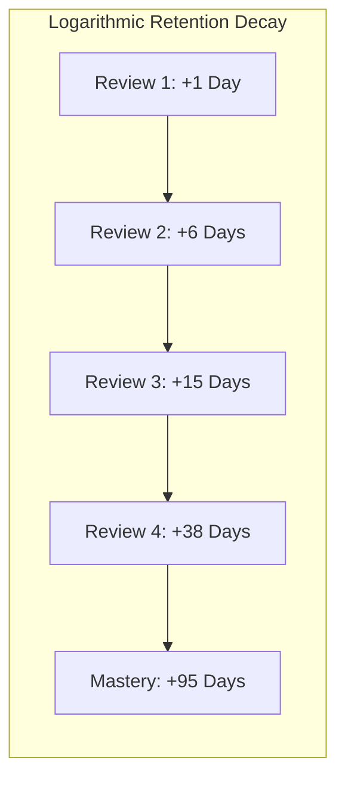
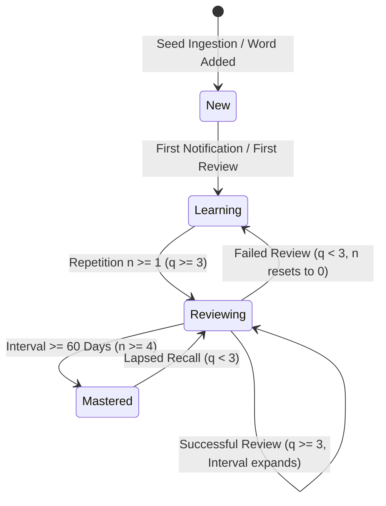
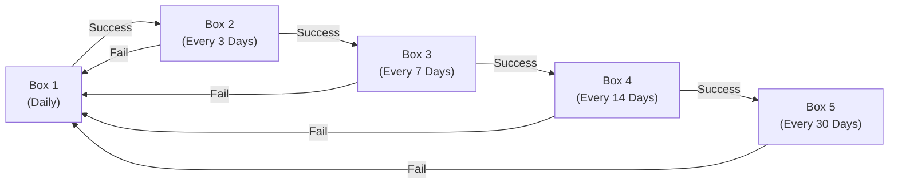

# Vocabula Spaced Repetition (SRS) Engine

This document outlines the theoretical foundation, mathematical algorithms, state transitions, and implementation code for Vocabula's on-device Spaced Repetition System (SRS).

---

## 1. Theoretical Foundation: The Forgetting Curve

Human memory follows a logarithmic decay curve (the Ebbinghaus Forgetting Curve). Without intervention, retention of new vocabulary drops precipitously within 48 hours. By testing recall at dynamically expanding time intervals—just as the memory is about to be forgotten—the neural connection is consolidated with minimal repetition effort.



Because Vocabula is 100% offline, all intervals, ease factors, and scheduling dates are computed in microseconds directly on-device using local SQLite records.

---

## 2. The SuperMemo-2 (SM-2) Algorithm

Vocabula utilizes an adapted version of Dr. Piotr Woźniak's **SuperMemo-2 (SM-2)** algorithm, widely regarded as the gold standard for adaptive flashcard scheduling.

### 2.1 Variables & Parameters

| Variable | Symbol | Definition | Initial Value | Bounds |
| :--- | :--- | :--- | :--- | :--- |
| **Quality Grade** | $q$ | User's self-assessed recall score | — | $0 \le q \le 5$ (Integer) |
| **Easiness Factor** | $EF$ | Difficulty multiplier for the word | $2.5$ | $EF \ge 1.3$ |
| **Repetition Count** | $n$ | Number of consecutive successful recalls ($q \ge 3$) | $0$ | $n \ge 0$ |
| **Interval** | $I$ | Days until the next scheduled review | $0$ | $I \ge 1$ |

### 2.2 The Recall Quality Scale ($q$)

* **5 (Perfect):** Immediate, effortless recall of definition and usage.
* **4 (Good):** Correct recall after brief hesitation. *(Assigned by lock-screen quick action "I Know This")*
* **3 (Pass):** Correct recall, but required noticeable mental effort.
* **2 (Hard Fail):** Incorrect response; the correct meaning felt familiar when revealed.
* **1 (Fail):** Incorrect response; remembered the word, but forgot the meaning.
* **0 (Blackout):** Complete amnesia regarding the word.

### 2.3 Mathematical Formulas

#### Step 1: Update Easiness Factor ($EF$)
After every review, the new easiness factor $EF'$ is calculated as:

$$EF' = EF + (0.1 - (5 - q) \times (0.08 + (5 - q) \times 0.02))$$

If $EF' < 1.3$, it is clamped to the minimum floor:

$$EF' = \max(1.3, EF')$$

> **Effect:** If the user rates a word 5, $EF$ increases slightly (making future intervals grow faster). If rated 3 or below, $EF$ drops significantly, shortening future intervals.

#### Step 2: Update Repetition Number ($n$) and Next Interval ($I$)
If the response was successful ($q \ge 3$):
* For $n = 0$: $I_1 = 1 \text{ day}$
* For $n = 1$: $I_2 = 6 \text{ days}$
* For $n \ge 2$: $I_n = \text{round}(I_{n-1} \times EF')$
* Increment repetition count: $n = n + 1$

If the response was unsuccessful ($q < 3$):
* The repetition streak resets: $n = 0$
* The interval resets: $I = 1 \text{ day}$
* The $EF'$ retains its lowered penalty from Step 1 so the word appears more frequently until mastered.

---

## 3. Vocabulary State Machine

Each word progresses through distinct retention states based on review history:



* **`new`:** In seed dictionary, not yet served via notification or manual study.
* **`learning`:** Introduced to the user; interval is 1–6 days ($n < 2$).
* **`reviewing`:** Successfully retained for multiple intervals ($n \ge 2$, $I < 60\text{ days}$).
* **`mastered`:** Long-term retention established ($I \ge 60\text{ days}$). Words in this tier only resurface as periodic maintenance checks.

---

## 4. Production TypeScript Implementation

Below is the standalone mathematical engine utilized by Vocabula's review service:

```typescript
// services/srs/sm2.ts

export interface SM2Input {
  grade: 0 | 1 | 2 | 3 | 4 | 5;
  repetitionNumber: number;
  easeFactor: number;
  intervalDays: number;
}

export interface SM2Output {
  repetitionNumber: number;
  easeFactor: number;
  intervalDays: number;
  nextReviewAt: number; // Unix timestamp in milliseconds
  status: 'learning' | 'reviewing' | 'mastered';
}

const MINIMUM_EASE_FACTOR = 1.3;
const DAY_IN_MS = 24 * 60 * 60 * 1000;

export function calculateSM2(input: SM2Input, reviewTimestamp: number = Date.now()): SM2Output {
  const { grade } = input;
  let { repetitionNumber, easeFactor, intervalDays } = input;

  // 1. Calculate new Ease Factor
  const newEaseFactor = Math.max(
    MINIMUM_EASE_FACTOR,
    easeFactor + (0.1 - (5 - grade) * (0.08 + (5 - grade) * 0.02))
  );

  // 2. Calculate new interval and repetition number
  if (grade >= 3) {
    if (repetitionNumber === 0) {
      intervalDays = 1;
    } else if (repetitionNumber === 1) {
      intervalDays = 6;
    } else {
      intervalDays = Math.round(intervalDays * newEaseFactor);
    }
    repetitionNumber += 1;
  } else {
    // Failed recall: reset repetition counter and schedule for tomorrow
    repetitionNumber = 0;
    intervalDays = 1;
  }

  // 3. Determine status
  let status: 'learning' | 'reviewing' | 'mastered' = 'learning';
  if (intervalDays >= 60) {
    status = 'mastered';
  } else if (repetitionNumber >= 2) {
    status = 'reviewing';
  }

  const nextReviewAt = reviewTimestamp + intervalDays * DAY_IN_MS;

  return {
    repetitionNumber,
    easeFactor: Number(newEaseFactor.toFixed(2)),
    intervalDays,
    nextReviewAt,
    status,
  };
}
```

---

## 5. Leitner 5-Box Alternative Model

For users who prefer a simpler, visual box-progression mental model rather than decimal intervals, Vocabula supports a **Leitner System** mode:



* **Box 1:** Reviewed every day.
* **Box 2:** Reviewed every 3 days.
* **Box 3:** Reviewed every 7 days.
* **Box 4:** Reviewed every 14 days.
* **Box 5:** Reviewed every 30 days (Retained).
* Any incorrect answer immediately drops the card back to **Box 1**.

---

## 6. Overdue Handling & Grace Periods

A common pitfall of flashcard applications is the "backlog wall": if a user skips 7 days, they are greeted with 200 overdue reviews, causing discouragement and abandonment.

### Vocabula Grace Strategy
1. **No Compounding Penalties:** Lapsed review calculations treat overdue time gently. The new interval is computed from the date of the actual review, not the missed target date.
2. **Daily Quota Cap:** The daily review queue caps active SRS reviews at a configurable maximum (e.g., 15 words/day). Excess due words roll forward seamlessly into subsequent days.
